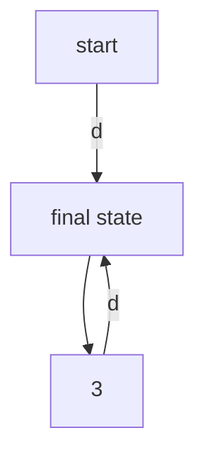
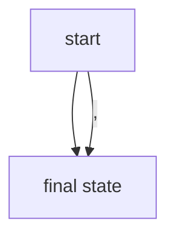
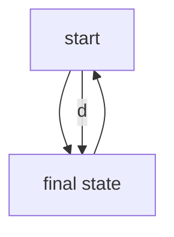

# Opgave 1

## Giv en uformel beskrivelse af sproget

Sproget beskriver alle positive komma og heltal. Det mindste tal der beskrives
af udtrykket er 0.

- 0
- 1,2
- 123
- 123,99999999

## Tilstandsmaskine

### Vil tilstandsmaskinen acceptere netop de strenge, som genkendes af det regulære udtryk?

Ja det vil den. Hvis man splitter det regulære udtryk op i mindre dele vil man
kunne se hvorfor.

```
d+
```

vil blive til



```
','?
```

vil blive til



```
d*
```

vil blive til



Det er indlysende at se at disse alle er en del af den givne graf.

### Er tilstandsmaskinen DFA eller NFA?

At en tilstandsmaskine er ikke-deterministisk er hvis man kan være i flere
tilstande på samme tid. Tilstandsmaskinen er NFA da der er epsilon kanter fra
knude 2, 4, 5. Dette vil altså sige at vi ville kunne være i tilstand 2-7 på
samme tid.

## Angiv et regulært udtryk

Det givne regulære udtryk opfylder allerede eet af kravene hvilket er at der
også tillades heltal. Ellers kan vi modificere det eksisterende regulære udtryk.
Vi kan starte med at gøre så der er et tal påkrævet efter kommaet.

```
d+(','d+|d*)
```

Hvis vi også vil kunne matche den tomme streng skal vi blot tilføje et `?`

```
(d+(','d+|d*))?
```

## Lav en lexer specifikation

```fsharp
{ // starting

module Hello_fslex
open FSharp.Text.Lexing
open System
}

rule Tokenize = parse
  | ['0'-'9']*  eof     { LexBuffer<char>.LexemeString lexbuf }
  | ['0'-'9']+','['0'-'9']+eof  { LexBuffer<char>.LexemeString lexbuf }
  | _               { failwith "Lexer error: illegal symbol" }


{ // ending

[<EntryPoint>]
let main argv =
      printfn "Hello World from FsLex!\n\nPlease pass a digit:"
      let input = Console.ReadLine()
      let res=Tokenize (LexBuffer<char>.FromString input)
      printfn "The lexer recognizes %s" res
      0

}
```

```
Hello World from FsLex!

Please pass a digit:

The lexer recognizes 
Hello World from FsLex!

Please pass a digit:
12,12
The lexer recognizes 12,12
```

# Opgave 2

## Opgave 2.1

```fsharp
let iconEx1 = Every(Write(FromTo(1,6)))
let iconEx2 = 
    Every(
        Write(
            Prim("+", 
                Prim("*", 
                    CstI 10, 
                    FromTo(3,6)
                ),
                FromTo(3,4)
            )
        )
    )
let iconEx3 = 
    Every(
        Write(
            FromToBy(1, 10, 3)
        )
    )
let iconEx4 = 
    Every(
        Write(
            Prim("+", 
                FromToBy(30, 60, 10),
                FromTo(3,4)
            )
        )
    )
let iconEx5 = 
    Every(
        Write(
            FromToBy(10, 11, 0)
        )
    )
```
